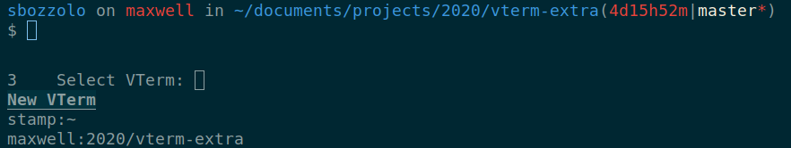

# vterm-extra

Improve the user experience in [vterm](https://github.com/akermu/emacs-libvterm) with convenience functions.
PR are welcome.

## Installation

The most simple way to install this package is with `use-package`:
```emacs-lisp
(use-package vterm-extra
              :load-path  "/path/of/the/repo/"
              :bind ("s-t" . vterm-extra-dispatcher))
```

## Functions available

### `vterm-extra-dispatcher`

`vterm-extra-dispatcher` allows to easily switch to VTerm buffers or create a
new ones if. If there are no VTerm buffers, or the current one is the only one,
`vterm-extra-dispatcher` creates a new one. If the current buffer is the only
VTerm buffer, it creates a new one. Otherwise, if there are other VTerm buffer
there are other, it prompts the user for a new one to select (or to create), and
it switches to that buffer. When called with prefix argument,
`vterm-extra-dispatcher` always creates a new VTerm.

This function is particularly useful when VTerm buffers have names that indicate
the associated hostname and path (see screenshot).



### `vterm-extra-edit-command-in-new-buffer`

This function allows to edit commands in a separate temporary buffer. It kills
the current command, create a temporary buffer. When `vterm-extra-edit-done` is
called (bound to `C-c C-c` by default), the content of the buffer is sent to the
associated vterm. This is done line by line, so the file has to be a valid
multi-line command or series of commands. A trailing newline corresponds to
sending the command.

A current limitation is that partially
input commands that span multiple lines are not correctly transferred over the
temporary buffer.

This function can be used to send a list of commands that are executed one after
the other.
